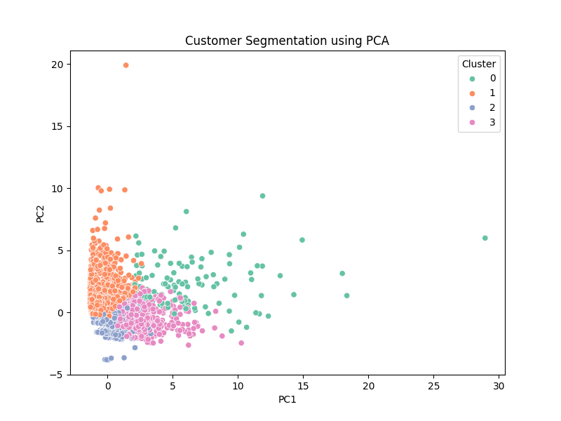
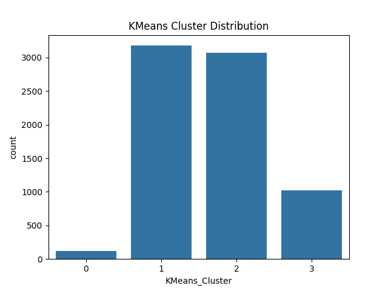
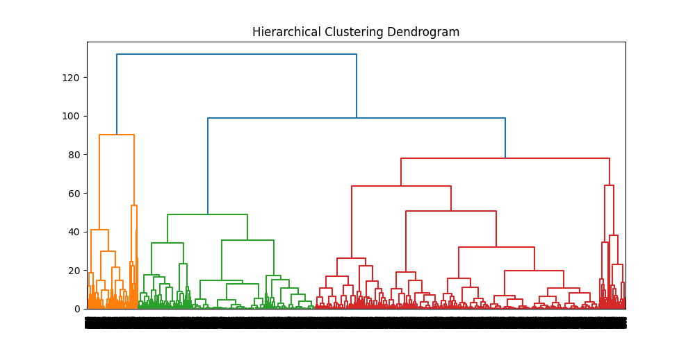

Customer Segmentation using Unsupervised Learning

 Project Title

AI-Driven Customer Intelligence System for Strategic Business Decision Making


Problem Statement

Organizations today collect large volumes of customer data but lack labeled information to:

* Identify high-value customers
* Detect customers likely to churn
* Understand spending patterns
* Optimize marketing strategies

This project addresses the problem by applying unsupervised machine learning techniques to discover hidden customer segments and generate actionable business insights.


Dataset Description

* Dataset: E-commerce Behavior Dataset (Kaggle) - https://www.kaggle.com/datasets/mkechinov/ecommerce-behavior-data-from-multi-category-store?utm_source=chatgpt.com
* Records Used: 500,000+ (sampled from large dataset)
* Type: Real-world customer interaction data

Features:

* user_id – Unique customer identifier
* event_type – (view, cart, purchase)
* price – Product price
* category_code – Product category
* event_time – Timestamp of interaction


Algorithms Used

The following clustering algorithms were implemented and compared:

* K-Means Clustering
* DBSCAN (Density-Based Clustering)
* Hierarchical Clustering
* Gaussian Mixture Model (GMM)

Technologies Used
* Python
* Pandas
* NumPy
* Matplotlib & Seaborn
* Scikit-learn


Project Workflow

1. Data Preprocessing

* Removed missing values
* Filtered invalid price values
* Converted timestamps to datetime
* Removed duplicate records

2. Exploratory Data Analysis (EDA)

* Event type distribution
* Price distribution
* Category popularity
* Time-based activity analysis

3. Feature Engineering

RFM Features:

* Recency – Last purchase time
* Frequency – Number of purchases
* Monetary – Total spending

Behavioral Features:

* Views
* Carts
* Purchase Ratio
* Average Spend


4. Clustering Models

Applied multiple algorithms:

* K-Means
* DBSCAN
* Hierarchical
* GMM

5. Model Evaluation

Used scientific methods:

* Elbow Method (Inertia)
* Silhouette Score
* Davies-Bouldin Index


6. Dimensionality Reduction

* Applied PCA (Principal Component Analysis)
* Visualized clusters in 2D space


How to Run the Project

Step 1: Clone the Repository

git clone https://github.com/Aishwarya26953/customer-segmentation-unsupervised-M_A_Aishwarya.git
cd customer-segmentation-unsupervised-M_A_Aishwarya

Step 2: Install Dependencies

```bash
pip install -r requirements.txt
```

Step 3: Run the Project

```bash
python main.py
```


Key Results

* Optimal number of clusters: 4
*  Best performing algorithm: K-Means
*  Clear separation of customer segments using PCA

Evaluation Metrics:

* Silhouette Score → Measures cluster quality
* Davies-Bouldin Index → Measures cluster separation


 Customer Segments Identified

* High-Value Customers – High spending & frequent purchases
* Frequent Browsers– High views, low conversion
* Low Spenders – Low activity and spending
* At-Risk Customers – Declining engagement

Sample Visualizations 
🔹 PCA Cluster Visualization
    

🔹 Cluster Distribution
    

🔹 Hierarchical Dendrogram
    

Business Insights

* Target high-value customers with premium offers
* Convert browsers using discounts and recommendations
* Retain at-risk customers with special campaigns
* Increase engagement of low spenders


 main.py Functionality

The main.py file performs the complete ML pipeline:

* Load dataset
* Perform preprocessing
* Apply feature engineering
* Train clustering models
* Evaluate clustering performance
* Print:

  * Number of clusters
  * Silhouette Score
  * Davies-Bouldin Index
* Save outputs in results/ folder


Project Structure

```
customer-segmentation-unsupervised/
│
├── data/
│   ├── raw/
│   ├── processed/
│
├── notebooks/
│
├── src/
│   ├── clustering/
│   ├── data_preprocessing.py
│   ├── feature_engineering.py
│   ├── evaluation.py
│   ├── utils.py
│
├── results/
│   ├── cluster_plots/
│   ├── pca_outputs/
│   ├── metrics/
│
├── requirements.txt
├── main.py
├── README.md
```


Conclusion

This project demonstrates how unsupervised learning can transform raw customer data into meaningful insights. It enables businesses to improve decision-making, optimize marketing strategies, and increase customer retention.


